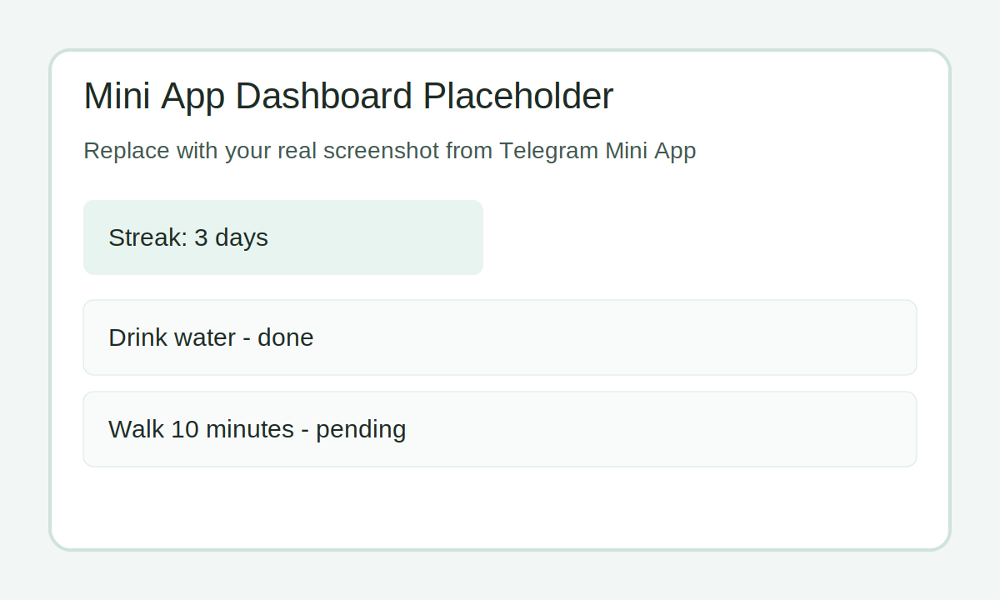
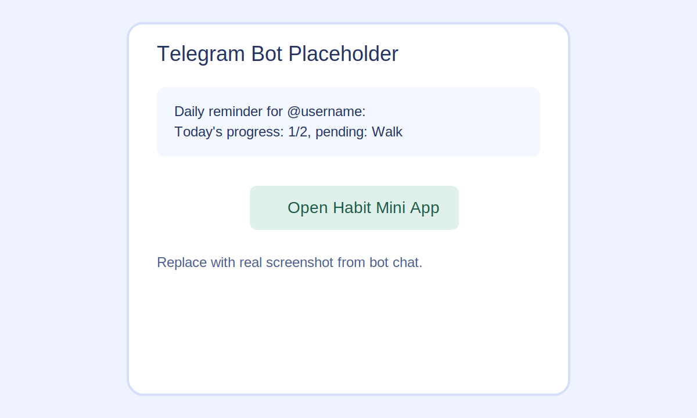

# Minimal Habit Bot

Minimal Telegram Mini App for tracking daily habits with one-tap check-ins and streak motivation.

## Demo

Replace these placeholders with real screenshots before final submission.




## Product Context

- End users: people who want to build better daily habits.
- Problem: people struggle to stay consistent with small daily actions.
- Solution: a lightweight habit tracker where users check in habits daily, track streaks, and receive Telegram reminders.

## Features

Implemented:

- Daily check-in for selected habits.
- Add and delete habits.
- Daily status by date.
- Streak counter with motivational messages.
- Telegram Mini App profile linking via Telegram `@username`.
- Telegram bot commands: `/start`, `/open`, `/streak`, `/notify_on`, `/notify_off`.
- Daily reminder messages with pending habits context.

Not yet implemented:

- Custom reminder text templates per user.
- Habit categories/tags and analytics charts.
- Full multi-language UI.

## Usage

1. Open the Telegram bot and send `/start`.
2. Tap `Open Habit Mini App`.
3. Add habits (for example: `Drink water`, `Walk 10 minutes`).
4. Use `Check in` daily to mark completed habits.
5. View streak and message in the app, or use `/streak` in Telegram.
6. Enable reminders with `/notify_on 20` (or another hour `0..23`).

## Deployment

Target VM OS:

- Ubuntu 24.04

Install on VM:

- `git`
- `python3`
- `systemd` (already available on Ubuntu VMs)
- Public HTTPS tunnel/domain for Telegram Mini App URL

Step-by-step deployment:

1. Clone repository:

```bash
git clone https://github.com/Alexapng/se-toolkit-hackathon.git
cd se-toolkit-hackathon
git checkout feature/task3-habit-bot-v1
```

2. Install/start backend service:

```bash
chmod +x deploy/install_systemd.sh
./deploy/install_systemd.sh --service-name habitbot --user "$USER" --host 0.0.0.0 --port 8000
```

3. Verify backend:

```bash
curl http://127.0.0.1:8000/health
sudo systemctl status habitbot --no-pager
```

4. Start Telegram bot service:

```bash
chmod +x deploy/install_telegram_bot_systemd.sh
./deploy/install_telegram_bot_systemd.sh --token "<BOT_TOKEN>" --web-app-url "https://<YOUR_PUBLIC_HTTPS_URL>"
```

5. Verify Telegram bot:

```bash
sudo systemctl status habitbot-telegram --no-pager
sudo journalctl -u habitbot-telegram -f
```

6. Set Mini App URL in `@BotFather` to the same HTTPS URL used in `--web-app-url`.

Useful service commands:

```bash
sudo systemctl restart habitbot
sudo systemctl restart habitbot-telegram
sudo journalctl -u habitbot -f
sudo journalctl -u habitbot-telegram -f
```

